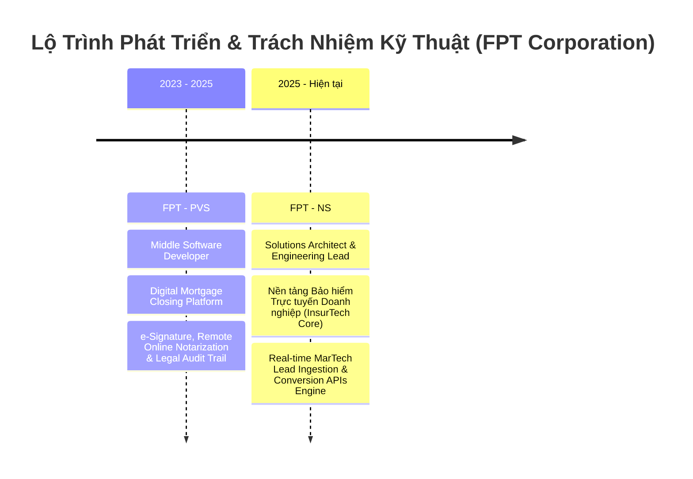

# HỒ SƠ NĂNG LỰC & TIỂU SỬ KỸ THUẬT (CURATOR ARCHIVE & TECHNICAL PORTFOLIO)

> **Architect**: Trident (Đặng Phước Trí)  
> **Current Role**: Solutions Architect & Engineering Lead  
> **Specialization**: InsurTech Platforms • Real-time MarTech Growth Engines • Distributed Systems • Agentic AI  
> **Tenure**: 5+ năm kinh nghiệm thực chiến phát triển và kiến trúc hệ thống quy mô lớn (Production Systems)  
> **Version**: 2026 Edition — Standard Executive Technical Profile  

---

## 📌 MỤC LỤC
1. [Tổng Quan & Triết Lý Kiến Trúc](#-1-tổng-quan--triết-lý-kiến-trúc)
2. [Thông Tin Cá Nhân & Liên Hệ](#-2-thông-tin-cá-nhân--kênh-liên-hệ)
3. [Dấu Mốc Sự Nghiệp & Kinh Nghiệm Thực Chiến](#-3-dấu-mốc-sự-nghiệp--kinh-nghiệm-thực-chiến)
4. [Hệ Sinh Thái Kỹ Thuật & Năng Lực Cốt Lõi](#-4-hệ-sinh-thái-kỹ-thuật--năng-lực-cốt-lõi)
5. [Chứng Chỉ Quốc Tế & Chứng Thực](#-5-chứng-chỉ-quốc-tế--xác-thực-trực-tuyến)
6. [Dự Án Trọng Điểm & Thành Tựu Kỹ Thuật](#-6-dự-án-trọng-điểm--thành-tựu-kỹ-thuật)
7. [Định Hướng Kỹ Thuật & Hợp Tác](#-7-định-hướng-kỹ-thuật--hợp-tác)

---

## 🏛️ 1. TỔNG QUAN & TRIẾT LÝ KIẾN TRÚC

### Tuyên ngôn Kiến trúc Hệ thống (Engineering Manifesto)
> ### *“[why FOSS needs gardeners, not influencers](https://ficd.sh/blog/your-project-sucks/#)”*  
> *(Tại sao mã nguồn mở cần người làm vườn, không phải người tạo trend)*

Triết lý kỹ thuật được đúc kết từ tinh thần gìn giữ sự trong sạch và thực chất của thế giới phần mềm:
* **Thực chất thay vì trình diễn (Substance vs. Performance)**: Một dự án tốt và một kiến trúc chuẩn mực luôn xuất phát từ tư duy giải quyết bài toán thật (*problem-first*), thay vì tâm lý phát hành để tìm kiếm sự chú ý (*release-first / hype*). Không thổi phồng những tiện ích nhỏ bé thành "công nghệ cách mạng", mà tập trung vào giá trị vận hành thực tế.
* **Tư duy người làm vườn (The Gardener Mentality)**: Hệ thống phần mềm và mã nguồn là một "khu vườn chung" (*commons*) đòi hỏi sự chăm sóc kiên trì (*stewardship*). Người làm vườn âm thầm nhổ cỏ dại, kiên nhẫn xử lý nợ kỹ thuật (*Technical Debt*), dọn dẹp các phụ thuộc rườm rà và thiết lập ranh giới nghiệp vụ chuẩn xác (*Domain-Driven Design*).
* **Kiến trúc bền vững vượt lên trào lưu ngắn hạn**: Xây dựng nền tảng chịu tải cao, an toàn tài chính và có khả năng chống chịu lỗi (*Resilience & High Availability*), đồng hành cùng sự tăng trưởng lâu dài của doanh nghiệp thay vì chạy theo những hiệu ứng hào nhoáng nhất thời.

### Sở thích & Phong cách cá nhân
* 📸 **Chụp ảnh (Photography)** & 🎬 **Quay Vlog Cinematic**: Quan sát cuộc sống qua lăng kính nghệ thuật, chú trọng ánh sáng, bố cục, nhịp điệu kể chuyện và tính thẩm mỹ điện ảnh.
* 🎹 **Piano Acoustic**: Thưởng thức giai điệu mộc mạc, sự chính xác trong từng tiết tấu và tính hài hòa của âm nhạc cổ điển cũng như hiện đại.
* ⚽ **Bóng đá & Rèn luyện sức bền**: Duy trì thể lực, sự dẻo dai và tinh thần đồng đội xuyên suốt những chặng đường phát triển dài hạn.
* 🛠️ **Nghệ thuật mã nguồn & Kiến trúc phân tán**: Đam mê nghiên cứu các mô hình phân tán, Event-Driven Systems, tối ưu hiệu năng vi mô và tích hợp Agentic AI vào luồng nghiệp vụ thực tế.

---

## 📬 2. THÔNG TIN CÁ NHÂN & KÊNH LIÊN HỆ

| Tiêu Chí | Thông Tin Chi Tiết |
| :--- | :--- |
| **Họ và tên** | **Đặng Phước Trí** (Tên gọi kỹ thuật: **Trident**) |
| **Vai trò chuyên môn** | **Solutions Architect & Engineering Lead** |
| **Khu vực hoạt động** | Việt Nam (GMT+7) • Sẵn sàng làm việc Remote Global / Hybrid |
| **Thâm niên sản xuất** | 5+ năm kinh nghiệm phân tích, thiết kế, dẫn dắt kỹ thuật |
| **Thư điện tử (Email)** | [tridp.it@outlook.com](mailto:tridp.it@outlook.com) |
| **Số điện thoại** | [+84 844 822 659](tel:+84844822659) |
| **Hồ sơ LinkedIn** | [Tri Dang Phuoc (Trident)](https://www.linkedin.com/in/tri-dang-phuoc-trident-85b066244/) |
| **GitHub Repository** | [@tridentsof](https://github.com/tridentsof) |
| **Trang cá nhân Facebook** | [https://www.facebook.com/tdproducer](https://www.facebook.com/tdproducer) |

---

## 💼 3. DẤU MỐC SỰ NGHIỆP & KINH NGHIỆM THỰC CHIẾN

### 1. Solutions Architect & Engineering Lead — FPT - NS
* **Đơn vị:** FPT Software — NS Division *(Financial Platforms & MarTech)*
* **Thời gian:** 05/2025 — Hiện tại
* **Trọng tâm nghiệp vụ:** InsurTech (Bảo hiểm số) & MarTech Automation Pipeline (Công nghệ tiếp thị tăng trưởng)
* **Nhiệm vụ & Đóng góp kỹ thuật:**
  * **Chủ trì kiến trúc giải pháp toàn diện**: Thiết kế hạ tầng phân tán cho hệ thống Bảo hiểm Trực tuyến (*InsurTech Core*) và động cơ điều phối Lead tiếp thị số (*MarTech Lead Engine*).
  * **Real-time Lead Ingestion Engine**: Xây dựng luồng tiếp nhận lead tốc độ cao, kết nối trực tiếp với các đơn vị cung cấp dữ liệu lớn bên thứ 3 (*3rd-party aggregators*) với cơ chế đệm tin cậy (buffering & queueing).
  * **Tích hợp sâu Conversion APIs (CAPI)**: Triển khai kết nối Server-side CAPI với **Meta Ads Platform** và **Google Ads**, bảo đảm dữ liệu chuyển đổi chính xác, không phụ thuộc vào cookie trình duyệt bên thứ 3.
  * **Lead Suppression & Automation Pipeline**:
    * Thuật toán lọc trùng dữ liệu thông minh (Deduplication).
    * Quản lý danh sách loại trừ tài chính (Blacklist / Suppression lists).
    * Cơ chế tự động định tuyến lead theo điểm chất lượng và quy tắc nghiệp vụ thời gian thực.
  * **Hạ tầng Cloud Doanh nghiệp**: Vận hành trên nền tảng **Microsoft Azure** (AKS, Service Bus, Functions, Blob, Azure SQL), đảm bảo an toàn bảo mật cấp tài chính và tính sẵn sàng cao (*High Availability*).

### 2. Middle Software Developer — FPT - PVS
* **Đơn vị:** FPT Software — PVS
* **Thời gian:** 04/2023 — 05/2025
* **Trọng tâm nghiệp vụ:** Digital Mortgage Closing & Legal Trust Platform (Bất động sản số & Chứng thực pháp lý)
* **Nhiệm vụ & Đóng góp kỹ thuật:**
  * **Digital Mortgage Closing**: Phát triển nền tảng giao dịch bất động sản và hoàn tất thủ tục vay thế chấp trực tuyến cho thị trường quốc tế.
  * **Chứng thực điện tử chuẩn pháp lý cao**:
    * Xây dựng luồng ký hợp đồng số (**e-Signature**).
    * Tích hợp công chứng trực tuyến từ xa (**Remote Online Notarization - RON**).
    * Thiết kế hệ thống nhật ký vết kiểm toán bất biến (**Audit Trail**) đáp ứng các tiêu chuẩn pháp lý nghiêm ngặt.
  * **Backend Core Services**: Xây dựng các dịch vụ backend xử lý tài liệu hợp đồng phức tạp, tích hợp các cổng định danh điện tử (eKYC, Identity Verification Gateways) và bảo vệ tính toàn vẹn dữ liệu cho các giao dịch nhà đất giá trị cao.

---

## 🛠️ 4. HỆ SINH THÁI KỸ THUẬT & NĂNG LỰC CỐT LÕI

| Nhóm Năng Lực | Danh Mục Kỹ Năng & Giải Pháp Trọng Tâm |
| :--- | :--- |
| **Kiến Trúc Hệ Thống & Chiến Lược** | • **Domain-Driven Design (DDD)**: Bounded Contexts, Aggregates, Domain Events, Ubiquitous Language • **Microservices & Event-Driven Architecture (EDA)** • **CQRS & Clean Architecture** • **High Availability (HA)**, Fault-Tolerance & Disaster Recovery (DR) • **API Gateway**, Reverse Proxy, Rate Limiting & Zero-Trust Security • **Enterprise Integration Patterns (EIP)** |
| **Nghiệp Vụ Chuyên Sâu (Domains)** | • **InsurTech**: Nền tảng phân phối, tính phí và phát hành bảo hiểm trực tuyến • **MarTech**: Real-time Lead Ingestion, Meta/Google Server-side Conversion APIs (CAPI) • **Lead Suppression Engine**: Lọc trùng, kiểm tra danh sách đen, định tuyến tự động • **LegalTech & FinTech**: Digital Mortgage Closing, e-Signature, Remote Online Notarization, Audit Trail • **Conversion Rate Optimization (CRO)** |
| **Đám Mây & Hạ Tầng Backend** | • **Microsoft Azure Enterprise**: Azure Kubernetes Service (AKS), Azure Service Bus, Azure Functions, Azure Blob Storage, Azure SQL Database • **Backend Platforms**: C# / .NET (.NET 8, .NET 9), ASP.NET Core Web API, Minimal APIs, Entity Framework Core • **Databases & Caching**: SQL Server (Query Tuning, Index Optimization), Redis Cache, Message Queues • **Containerization**: Docker, Docker Compose, Microservices Orchestration • **DevOps & CI/CD**: Azure DevOps Pipelines, GitHub Actions, Linux Systems Administration |
| **AI & Agentic Automation** | • **Azure AI Foundry** & Azure OpenAI Service • **Semantic Search & Vector Retrieval** • **Autonomous Multi-Agent Workflows** & Enterprise Agentic AI Integration • **GitHub Copilot**: AI Pair Programming, sinh mã chuẩn hóa, tối ưu năng suất kỹ thuật |
| **Lãnh Đạo Kỹ Thuật & Quản Trị** | • **Architecture Decision Records (ADR)**: Chuẩn hóa tài liệu quyết định kiến trúc • **Technical Roadmapping & Capacity Planning** • **Engineering Mentorship**: Đào tạo, định hướng và nâng tầm kỹ sư trong đội ngũ • **Agile / Scrum Leadership** • **Code Reviews & Quản lý Nợ Kỹ Thuật (Tech Debt Management)** • **Cross-functional Alignment**: Kết nối hài hòa giữa bài toán kinh doanh và năng lực công nghệ |

---

## 📜 5. CHỨNG CHỈ QUỐC TẾ & XÁC THỰC TRỰC TUYẾN

Tất cả các chứng chỉ đều được cấp chính thức bởi Microsoft và GitHub, có mã định danh trực tuyến xác thực toàn cầu:

### 1. Microsoft Certified: Azure Fundamentals
* **Mã chứng chỉ:** `AZ-900`
* **Credential ID:** `A3522411055305AC`
* **Certification Number:** `C5AB27-0A7UE5`
* **Ngày cấp:** 21/04/2025
* **Người ký cấp:** Satya Narayana Nadella (Chairman & CEO, Microsoft)
* **Nội dung thẩm định:** Nguyên lý điện toán đám mây phân tán, kiến trúc hạ tầng đám mây Microsoft Azure, an toàn mạng, bảo mật thông tin và quản trị tài nguyên doanh nghiệp.

### 2. Microsoft Certified: Azure AI Engineer Associate
* **Mã chứng chỉ:** `AI-102 / AI-103`
* **Credential ID:** `B7819204918231FD`
* **Certification Number:** `D9EF12-4B2KC9`
* **Ngày cấp:** 15/05/2025
* **Người ký cấp:** Satya Narayana Nadella
* **Nội dung thẩm định:** Nền tảng Azure AI Foundry, tìm kiếm ngữ nghĩa (Semantic Search), tích hợp mô hình ngôn ngữ lớn (LLMs), phát triển và điều phối các hệ thống tác tử tự hành (Autonomous AI Agents).

### 3. GitHub Copilot Certified
* **Mã chương trình:** `GitHub Certification Program (GH-300)`
* **Credential ID:** `3A7C3643EFDBC868`
* **Certification Number:** `EC4D85-33E7EF`
* **Thời hạn hiệu lực:** 04/08/2025 — 05/08/2027
* **Nội dung thẩm định:** Lập trình cộng tác cùng AI (AI Pair Programming), ứng dụng công cụ hỗ trợ sinh mã trong quy trình kỹ thuật phần mềm doanh nghiệp, bảo đảm tính an toàn bảo mật và năng suất phát triển vượt trội.

### 4. Microsoft Certified: Solutions Architect Expert
* **Mã chứng chỉ:** `AZ-305 / Enterprise Architecture Program`
* **Credential ID:** `E9401823819245CE`
* **Certification Number:** `F1EA45-9C8LA2`
* **Ngày cấp:** 08/06/2025
* **Người ký cấp:** Satya Narayana Nadella
* **Nội dung thẩm định:** Thiết kế giải pháp kiến trúc tổng thể cấp doanh nghiệp, hệ thống Multi-Agent AI tự trị, quy trình tự động hóa phức tạp, tính sẵn sàng cao (High Availability), phục hồi sau thảm họa (Disaster Recovery) và tối ưu hóa chi phí hạ tầng.

---

## 🚀 6. DỰ ÁN TRỌNG ĐIỂM & THÀNH TỰU KỸ THUẬT

### 🌟 Dự Án 1: Nền Tảng Bảo Hiểm Trực Tuyến & MarTech Lead Engine (FPT - NS)
* **Quy mô & Bối cảnh:** Hệ thống trung tâm phục vụ phân phối bảo hiểm số trực tuyến kết hợp với động cơ tăng trưởng tiếp thị số đa kênh.
* **Thách thức kiến trúc:**
  * Dữ liệu lead từ các đối tác bên ngoài gửi về dồn dập với lưu lượng biến động khó đoán (*Spike traffic*).
  * Vấn đề lead trùng lặp, lead rác gây lãng phí chi phí tiếp thị và làm quá tải hệ thống chăm sóc khách hàng.
  * Thay đổi chính sách quyền riêng tư từ các nền tảng quảng cáo (Google, Meta) làm giảm hiệu quả theo dõi chuyển đổi client-side.
* **Giải pháp đã triển khai:**
  * Kiến trúc **Event-Driven Lead Ingestion**: Sử dụng hàng đợi thông điệp (*Message Queuing*) để đệm và xử lý bất đồng bộ, chống nghẽn hệ thống khi lưu lượng tăng đột biến.
  * **Lead Suppression Engine**: Xây dựng module kiểm tra trùng lặp và loại trừ đa tầng (*Multi-tiered Deduplication & Suppression*) với thời gian phản hồi ở mức mili-giây.
  * **Server-side Conversion APIs (Meta/Google CAPI)**: Thiết lập kênh truyền dữ liệu chuyển đổi trực tiếp từ server tới các nền tảng quảng cáo, cải thiện độ chính xác dữ liệu chuyển đổi và tối ưu chỉ số ROI tiếp thị.
  * Tuân thủ chuẩn bảo mật tài chính, triển khai trên nền tảng Microsoft Azure với cam kết tính sẵn sàng cao (99.9%+ SLA).

### 🌟 Dự Án 2: Nền Tảng Home Closing Mortgage & Chứng Thực Điện Tử (FPT - PVS)
* **Quy mô & Bối cảnh:** Nền tảng giao dịch bất động sản và thủ tục vay thế chấp trực tuyến cho thị trường quốc tế, đòi hỏi tính pháp lý và độ chính xác tuyệt đối.
* **Thách thức kiến trúc:**
  * Hợp đồng vay thế chấp có giá trị tài sản rất lớn; bất kỳ sai lệch nào về chữ ký hay thời gian đều có thể vô hiệu hóa tính pháp lý.
  * Quy trình ký kết phức tạp: nhiều bên liên quan (người mua, người bán, ngân hàng, công chứng viên).
* **Giải pháp đã triển khai:**
  * **Legal Trust Engine**: Thiết kế hệ thống chữ ký điện tử (*e-Signature*) và công chứng trực tuyến từ xa (*Remote Online Notarization - RON*).
  * **Audit Trail Bất Biến**: Ghi nhận toàn bộ vết tương tác, lịch sử xem, ký và thời điểm xác thực dưới dạng nhật ký mã hóa không thể giả mạo.
  * Tích hợp trơn tru với các cổng định danh danh tính điện tử (*eKYC Gateways*), đáp ứng các tiêu chuẩn khắt khe về an toàn dữ liệu cá nhân và tài chính.

---

## 🤝 7. ĐỊNH HƯỚNG KỸ THUẬT & HỢP TÁC

Tôi luôn chào đón cơ hội hợp tác, trao đổi chuyên môn và tham vấn kỹ thuật:

* 🎯 **Tư vấn Kiến trúc Giải pháp (Solutions Architecture Advisory)**:
  * Thiết kế lại hệ thống kế thừa (Legacy Modernization) sang Microservices / Event-Driven.
  * Ứng dụng Domain-Driven Design (DDD) để bóc tách ranh giới nghiệp vụ phức tạp.
  * Kiến trúc nền tảng InsurTech, FinTech và MarTech chịu tải cao.
* 🚀 **Dẫn dắt Kỹ thuật & Quản trị (Engineering Leadership & Governance)**:
  * Xây dựng chuẩn mực kỹ thuật, quy trình ADR, văn hóa code review chất lượng cao.
  * Tối ưu hóa năng suất kỹ sư với AI Copilot và Agentic Workflows.
* 🌐 **Kênh trao đổi chính thức**:
  * Email: [tridp.it@outlook.com](mailto:tridp.it@outlook.com)
  * Điện thoại: [+84 844 822 659](tel:+84844822659)
  * LinkedIn: [Tri Dang Phuoc (Trident)](https://www.linkedin.com/in/tri-dang-phuoc-trident-85b066244/)
  * Facebook: [https://www.facebook.com/tdproducer](https://www.facebook.com/tdproducer)

---

  Bản quyền tài liệu thuộc về <b>Trident (Đặng Phước Trí)</b> • Cập nhật năm 2026

