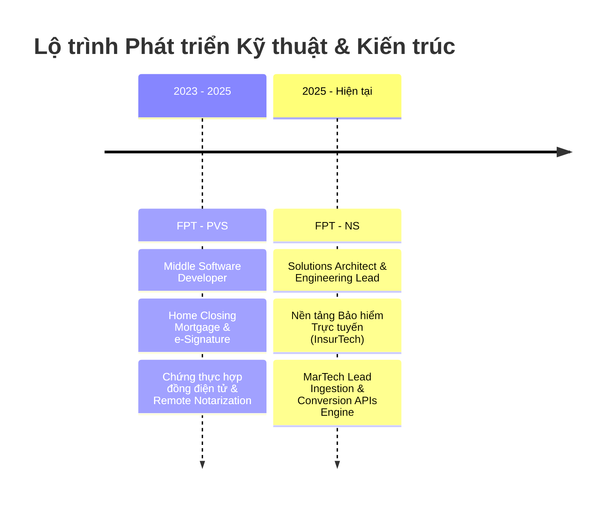

<p align="center">
  
</p>

<p align="center">
  <a href="https://github.com/tridentsof/personal-portfolio">
    
  </a>
</p>

<p align="center">
  <a href="https://github.com/tridentsof"></a>
  <a href="https://www.linkedin.com/in/tri-dang-phuoc-trident-85b066244/"></a>
  <a href="https://www.facebook.com/tdproducer"></a>
  <a href="mailto:tridp.it@outlook.com"></a>
</p>

---

## 🏛️ Về Kiến Trúc Sư — Trident (Đặng Phước Trí)

> ### *“[why FOSS needs gardeners, not influencers](https://ficd.sh/blog/your-project-sucks/#)”*
> *“Tại sao mã nguồn mở cần người làm vườn, không phải người tạo trend.”*

Tôi là **Đặng Phước Trí (Trident)**, hiện đảm nhiệm vai trò **Solutions Architect & Engineering Lead**. Với hơn 5 năm kinh nghiệm thực chiến trong việc thiết kế và vận hành các hệ thống phân tán quy mô lớn, tôi theo đuổi triết lý:
* **Thực chất thay vì trình diễn (Substance vs. Performance)**: Tập trung giải quyết bài toán thật (*problem-first*), loại bỏ tâm lý thổi phồng công nghệ theo trend (*release-first / hype*).
* **Tư duy người làm vườn (The Gardener Mentality)**: Hệ thống phần mềm như một khu vườn chung cần sự chăm sóc kiên trì — âm thầm dọn dẹp nợ kỹ thuật (*Technical Debt*), phân định ranh giới nghiệp vụ mạch lạc (*Domain-Driven Design*), và bảo đảm tính sẵn sàng cao (*High Availability*).
* **Đam mê cá nhân**: Nhiếp ảnh đường phố & chân dung (Photography), Quay vlog cinematic, Piano acoustic, Bóng đá rèn luyện sức bền và Nghệ thuật kiến trúc phân tán.

### 💼 Dấu Mốc Sự Nghiệp (Career Milestones)



#### 🔹 Solutions Architect & Engineering Lead | **FPT - NS** *(05/2025 — Hiện tại)*
- **Lĩnh vực trọng tâm:** InsurTech & MarTech Automation Pipeline.
- **Nhiệm vụ & Giải pháp kiến trúc:**
  - Chủ trì kiến trúc giải pháp cho **Hệ thống Bảo hiểm Trực tuyến** và nền tảng điều phối Lead tiếp thị số (**MarTech Lead Engine**).
  - Thiết kế luồng **Lead Ingestion thời gian thực** tích hợp với các đối tác cung cấp dữ liệu lớn bên thứ 3 (*3rd-party aggregators*).
  - Tích hợp chuyên sâu với **Google Ads & Meta Ads Platform** thông qua **Server-side Conversion APIs (CAPI)**.
  - Xây dựng cơ chế **Lead Suppression & Automation Pipeline**: lọc lead trùng lặp, xử lý danh sách loại trừ thông minh và điều hướng lead tự động.
  - Vận hành và đảm bảo an toàn tài chính, tính sẵn sàng cao (*High Availability*) trên nền tảng **Microsoft Azure**.

#### 🔹 Middle Software Developer | **FPT - PVS** *(04/2023 — 05/2025)*
- **Lĩnh vực trọng tâm:** Digital Mortgage Closing & Legal Trust Platform.
- **Nhiệm vụ & Đóng góp:**
  - Phát triển nền tảng giao dịch bất động sản và thủ tục vay thế chấp trực tuyến (**Home Closing Mortgage**).
  - Xây dựng luồng ký kết và chứng thực hợp đồng điện tử có giá trị pháp lý cao (**e-Signature, Remote Online Notarization, Audit Trail**).
  - Thiết kế các backend services xử lý luồng tài liệu phức tạp, tích hợp các cổng định danh điện tử (eKYC / Identity Gateways) và bảo toàn tính toàn vẹn dữ liệu cho giao dịch giá trị cao.

---

## 🛠️ Hệ Sinh Thái Kỹ Thuật & Năng Lực Cốt Lõi

| Nhóm Năng Lực | Công Nghệ & Giải Pháp Trọng Tâm |
| :--- | :--- |
| **Kiến Trúc Hệ Thống** | Domain-Driven Design (DDD), Event-Driven Architecture, Microservices, CQRS, Clean Architecture, High-Load & High-Availability Design |
| **Nghiệp Vụ Chuyên Sâu** | **InsurTech** (Online Insurance Platforms), **MarTech** (Lead Engine, Conversion APIs), **LegalTech/FinTech** (Digital Mortgage, Remote Online Notarization, Audit Trail) |
| **Đám Mây & Hạ Tầng** | Microsoft Azure (App Services, Service Bus, Azure Functions, Blob Storage), Docker, CI/CD Automation, Distributed Caching |
| **AI & Tự Động Hóa** | Azure AI Foundry, Semantic Search, Autonomous Multi-Agent Workflows, Agentic AI Architectures, GitHub Copilot |
| **Lãnh Đạo Kỹ Thuật** | Technical Roadmapping, Code Quality & ADR Documentation, Mentoring, Cross-functional Stakeholder Management |

---

## 📜 Chứng Chỉ Quốc Tế (Certifications)

<p align="center">
  
  &nbsp;
  
  &nbsp;
  
  &nbsp;
  
</p>

* **Microsoft Certified: Azure Cloud Fundamentals** — Điện toán phân tán, mô hình mạng đám mây, bảo mật hạ tầng và quản trị tài nguyên Azure.
* **Phát triển Ứng dụng & Agent AI trên Azure** — Azure AI Foundry, Semantic Search, LLM Integration và mô hình Agent tự hành.
* **Kiến Trúc Sư Giải Pháp Doanh Nghiệp với Agentic AI** — Multi-Agent Systems, tự động hóa quy trình nghiệp vụ phức tạp trong doanh nghiệp.
* **GitHub Copilot Certified** — Lập trình cộng tác AI, gia tăng năng suất kỹ thuật và chuẩn mực sinh mã tự động.

---

## 🚀 Dự Án Trọng Điểm Doanh Nghiệp (Featured Enterprise Systems)

* 🛡️ **Hệ Thống Bảo Hiểm Trực Tuyến & MarTech Lead Engine (FPT - NS)**:
  - Chủ trì kiến trúc giải pháp hệ thống phân phối bảo hiểm số (InsurTech) và động cơ điều phối Lead tiếp thị số thời gian thực.
  - Xây dựng luồng tiếp nhận lead đa đối tác (3rd-party aggregators), tích hợp sâu Server-side Conversion APIs (Meta/Google CAPI) và cơ chế Lead Suppression chống trùng lặp dữ liệu tài chính trên Microsoft Azure.
* 📜 **Home Closing Mortgage & Chứng Thực Hợp Đồng Điện Tử (FPT - PVS)**:
  - Phát triển nền tảng hoàn tất thủ tục thế chấp bất động sản số (Digital Mortgage Closing).
  - Triển khai luồng ký số pháp lý cao (e-Signature), công chứng trực tuyến từ xa (Remote Online Notarization - RON) và vết kiểm toán bất biến (Audit Trail).

---

## ⚡ Cài Đặt & Chạy Thử Nghiệm Tại Máy Cục Bộ

### 1. Yêu cầu môi trường
* **Node.js**: Phiên bản `>= 18.0.0`
* **npm** hoặc **pnpm / yarn**

### 2. Khởi chạy dự án

```bash
# Clone repository
git clone https://github.com/tridentsof/personal-portfolio.git

# Di chuyển vào thư mục dự án
cd personal-portfolio

# Cài đặt dependencies
npm install

# Khởi chạy máy chủ phát triển (Dev Server)
npm run dev
```

Truy cập `http://localhost:5173` để trải nghiệm trực tiếp không gian làm việc số.

### 3. Đóng gói triển khai (Build)

```bash
npm run build
```
Thư mục `dist/` sẽ sẵn sàng để deploy lên GitHub Pages, Vercel, Netlify hoặc Azure Static Web Apps.

---

## 📊 Hoạt Động GitHub (GitHub Metrics)

<p align="center">
  
  
</p>

---

## 📬 Kết Nối & Hợp Tác

Tôi luôn sẵn sàng trao đổi và thảo luận về các cơ hội tư vấn giải pháp kiến trúc hệ thống **InsurTech / MarTech**, kỹ thuật phân tán quy mô lớn hoặc vai trò **Lead Engineering**:

- 📍 **Địa điểm:** Việt Nam (GMT+7) / Remote Global
- 📧 **Email Trực Tiếp:** [tridp.it@outlook.com](mailto:tridp.it@outlook.com)
- 📱 **Số Điện Thoại:** [+84 844 822 659](tel:+84844822659)
- 💼 **LinkedIn:** [Tri Dang Phuoc (Trident)](https://www.linkedin.com/in/tri-dang-phuoc-trident-85b066244/)
- 🐙 **GitHub:** [@tridentsof](https://github.com/tridentsof)
- 🌐 **Facebook:** [https://www.facebook.com/tdproducer](https://www.facebook.com/tdproducer)

<p align="center">
  <sub>Thiết kế và kiến tạo bởi <b>Trident (Đặng Phước Trí)</b> • 2026</sub>
</p>
